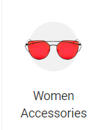

# ESTI Project - Structure & Setup Guide

## Project Structure

After reorganization, your project should have the following structure:

```
ESTI/
├── assets/
│   ├── images/           # All image files (.jpg, .png, .gif, .webp)
│   ├── css/              # Stylesheet files
│   │   └── ESTI.css
│   └── js/               # JavaScript files
│       └── ESTI.js
├── pages/                # All HTML files (to move here)
│   ├── ESTIhome.html
│   ├── ESTIintro.html
│   ├── ESTIlogIn.html
│   ├── ESTIlogNext.html
│   ├── ESTInext.html
│   ├── ESTIsignNext.html
│   └── ESTIsignUp.html
├── index.html            # Main entry point
└── README.md             # Project documentation
```

## Setup Instructions

### Step 1: Move Files to Assets Folder

#### Images  
Move all image files to `assets/images/`:
- EstiAutumn.jpg, try3.webp, home.jpg, try5.jpg, EstiPotter.jpg
- cat1.png through cat14.png
- bannerMOOO.gif, home2.1.webp
- vanLogin.gif, vanLoginsEQUEL.gif, logIn.gif, logdupp.gif
- facebookMo.png, googlemo2.png
- line-removebg-preview.png, line-removebg-preview1.png
- All other image files

#### CSS
Move `ESTI.css` to `assets/css/ESTI.css`

#### JavaScript
Move `ESTI.js` to `assets/js/ESTI.js`

### Step 2: Update HTML File References

#### CSS Link
Change from:
```html
<link rel="stylesheet" href="ESTI.css">
```
To:
```html
<link rel="stylesheet" href="assets/css/ESTI.css">
```

#### JavaScript Script
Change from:
```html
<script src="ESTI.js"></script>
```
To:
```html
<script src="assets/js/ESTI.js"></script>
```

#### Image References
Change all `src="imagename.ext"` to `src="assets/images/imagename.ext"`

Examples:
```html
<!-- Before -->


<!-- After -->

```

### Step 3: Update CSS File References

If there are any image references in `ESTI.css` using `url()`, update them similarly:

```css
/* Before */
background-image: url('image.png');

/* After */
background-image: url('assets/images/image.png');
```

## Automated Update Script

A Python script `update_paths.py` has been created to automate these updates.

To use it:
1. Ensure all image files are still in the main ESTI folder
2. Run: `python update_paths.py`
3. Then move the folders as outlined above

## File Reference Table

| File | Current Location | New Location | Update Type |
|------|------------------|--------------|-------------|
| ESTI.css | `./ESTI.css` | `./assets/css/ESTI.css` | Move & Update refs |
| ESTI.js | `./ESTI.js` | `./assets/js/ESTI.js` | Move & Update refs |
| All images | `./` | `./assets/images/` | Move & Update refs |
| HTML files | `./` | `./pages/` | Optional (Update refs to assets) |

## Testing After Migration

After moving files and updating references:

1. **Test image loading**: All images should display correctly
2. **Test styles**: Page styling should render properly
3. **Test functionality**: Dropdown menu and form interactions should work
4. **Check console**: Open browser dev tools (F12) and check for 404 errors

## Benefits of New Structure

- **Organized**: Assets separated from code  
- **Maintainable**: Easy to find and update files
- **Scalable**: Can easily add new asset types (fonts, videos, etc.)
- **Professional**: Follows web development best practices

## Notes

- The `pages/` folder is optional but recommended for better organization
- You can keep HTML files in the root if preferred (update path references accordingly)
- Always test in a browser after making changes to ensure all paths are correct
